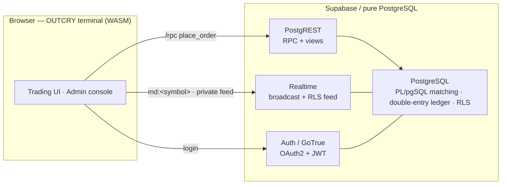

<div align="center">

# pg-outcry · OUTCRY

**A complete central exchange (CEX), running entirely inside PostgreSQL.**
**一套完整的中心化交易所（CEX），全部跑在 PostgreSQL 里。**

Matching · Settlement · Wallet · Risk · Realtime · Auth — **no application server in the request path.**
撮合 · 结算 · 钱包 · 风控 · 实时行情 · 鉴权 —— **请求路径上没有任何应用服务器。**

`PostgreSQL` · `PostgREST` · `Supabase Realtime` · `Supabase Auth (GoTrue)` · `WebAssembly` · `pgvector-class extensions`

[English](#english) · [中文](#中文) · [Quickstart](#quickstart--快速开始) · [Deploy](./DEPLOY.md) · [Performance](./PERFORMANCE.md) · [Dev](./DEVELOPMENT.md)

</div>

---

## What is this? / 这是什么？

The matching engine is ~2,400 lines of **PL/pgSQL** (built on [tolyo/open-outcry](https://github.com/tolyo/open-outcry)).
Everything a trader or operator touches is a **PostgREST RPC**, a **Supabase Realtime** channel, or a **Supabase Auth** session.
There is no Go/Java/Rust order-matching service, no Kafka, no Redis, no separate ledger microservice — the database *is* the exchange.

撮合引擎是约 2,400 行 **PL/pgSQL**（基于 [tolyo/open-outcry](https://github.com/tolyo/open-outcry)）。
交易者和运营碰到的一切，都是一次 **PostgREST RPC**、一个 **Supabase Realtime** 频道、或一个 **Supabase Auth** 会话。
没有独立的撮合服务，没有 Kafka、没有 Redis、没有单独的账本微服务 —— **数据库本身就是交易所**。



---

## English

### Why this design wins

| | Conventional CEX stack | **pg-outcry** |
|---|---|---|
| Matching engine | bespoke C++/Java service | PL/pgSQL inside the DB |
| Settlement | separate ledger service, eventual consistency | **same ACID transaction** as the match |
| Market data | Kafka → fan-out service → WS gateway | Supabase Realtime (broadcast + RLS feed) |
| Per-user security | hand-rolled authz layer | **Postgres RLS** (zero custom authz code) |
| Moving parts | 5–15 services + brokers + caches | **one database + Supabase** |
| Ops team to run it | a platoon | **one or two engineers** |

- **Correct by construction.** Order match *and* full double-entry settlement happen in **one database transaction** — no cross-service synchronization, no "trade booked but ledger lagged" class of bugs.
- **Auditable money.** The ledger is **append-only** (triggers reject UPDATE/DELETE) and a built-in `reconcile()` continuously checks 5 invariants (cash == ledger, double-entry balanced, reservations sane, every approved wallet op has a settlement transfer, issuance conserved). Every admin action is written to an audit log.
- **Realtime included.** Public market data streams over Broadcast (`md:<symbol>`: coalesced L2 + trade tape); each user's order/fill/wallet stream rides Postgres Changes **scoped by RLS** — a user receives only their own rows, with no relay server and no per-user topic wiring.
- **Secure by default.** Identity is Supabase Auth (OAuth2 + email); data isolation is Postgres RLS. Engine internals are locked down (`deny-by-default`, only a whitelist of RPCs is callable).
- **Deploys two ways from one codebase.** Push to **hosted Supabase** for a demo, or **self-host** for a high-performance build (UNLOGGED hot book, native C hot-path, WAL tuning). Privileged migration steps self-skip on hosted.
- **Batteries included.** A polished **WASM trading terminal** (candles + volume + SMA/EMA/Bollinger/VWAP/VMA + RSI/MACD/KDJ/ATR + drawing tools, all computed in WebAssembly) **and** a **back-office console** (approvals, suspensions, fees, risk, reconciliation, audit) ship in this repo.

### Why it's a perfect fit for small & mid-size exchanges

Big exchanges can afford a bespoke C++ matching engine and a 50-person platform team. **Small and mid-size exchanges cannot — and that's exactly who this is for.**

1. **Tiny operational footprint = tiny cost.** One PostgreSQL plus Supabase's managed services. No brokers, no caches, no service mesh. It can run on a modest managed Supabase project or a single VM. A 1–2 person team can operate the whole exchange.
2. **Launch in days, not quarters.** `supabase db reset` applies the schema; open the included terminal and admin console. You start with a *working* exchange, not a pile of microservices to integrate.
3. **Exchange-grade correctness you didn't have to build.** Double-entry ledger, fund reservations/freezes, idempotent deposits/withdrawals, reconciliation invariants, append-only audit trail, per-user RLS — the financial-integrity work that sinks small teams is already done and tested.
4. **Compliance & trust scaffolding out of the box.** Append-only ledger + reconciliation + admin audit log + account suspension + per-instrument risk limits (price bands, max order size/notional) give you the controls auditors and partners ask about.
5. **Cost scales with you.** Start on hosted Supabase; when volume grows, self-host and turn on the performance profile, or shard by symbol across nodes (documented, zero schema change — a CEX has no cross-symbol transactions).
6. **No lock-in, fully inspectable.** The matching and settlement logic is plain SQL you can read, fork, and audit. No black-box engine binary.

> In short: **the correctness, realtime, and compliance of a serious exchange — at the operational complexity and cost a small team can actually carry.**

### Feature set

- **Engine:** limit / market / stop-loss / stop-limit orders; GTC / IOC / FOK; self-trade prevention; maker/taker fees; price-time priority.
- **Settlement:** double-entry ledger, fund reservation/freeze, multi-currency + FX instruments, banker's rounding.
- **Wallet:** deposit/withdrawal requests with admin approval, idempotency keys, reservation on withdrawal.
- **Risk:** per-instrument max order amount / notional / price-band (fat-finger) checks.
- **Realtime:** public L2 + trade broadcast; private RLS-scoped order/fill/wallet feed.
- **Auth & security:** OAuth2 (GitHub/Google) + email; full RLS; deny-by-default function surface.
- **Back-office:** approvals queue, suspend/unsuspend, fee & risk config, reconciliation dashboard, audit log.
- **Frontend:** "phosphor terminal" WASM trading UI + admin console.
- **Performance:** per-symbol advisory-lock concurrency, monthly partitioning of trade/ledger, UNLOGGED in-memory book, WAL reduction, coalesced async market data, optional native C extension.

### Verified

The repo ships smoke tests covering **11 end-to-end flows** — matching, settlement & reservations, realtime tape + L2 broadcast, Auth+RLS isolation, wallet (idempotency + reconciliation), order types, stop-order activation, and the private feed — all green against a clean `supabase db reset`. See [`scripts/`](./scripts) and [`DEVELOPMENT.md`](./DEVELOPMENT.md).

---

## 中文

### 为什么这套架构更优

| | 传统 CEX 技术栈 | **pg-outcry** |
|---|---|---|
| 撮合引擎 | 定制 C++/Java 服务 | 数据库内的 PL/pgSQL |
| 结算 | 独立账本服务，最终一致 | 与撮合**同一个 ACID 事务** |
| 行情 | Kafka → 扇出服务 → WS 网关 | Supabase Realtime（广播 + RLS 私有流） |
| 用户级安全 | 自研鉴权层 | **Postgres RLS**（零自研鉴权代码） |
| 组件数量 | 5–15 个服务 + 消息队列 + 缓存 | **一个数据库 + Supabase** |
| 运维所需团队 | 一个排 | **一两个工程师** |

- **天然正确。** 撮合**和**完整的双边记账结算在**同一个数据库事务**里完成 —— 没有跨服务同步，杜绝"成交了但账本没跟上"这类 bug。
- **资金可审计。** 账本**只追加**（触发器拒绝 UPDATE/DELETE），内置 `reconcile()` 持续校验 5 条不变量（现金==账本、借贷平衡、冻结合理、每笔已批准充提都有结算流水、发行守恒）。每个管理操作都写入审计日志。
- **实时内建。** 公共行情走广播（`md:<symbol>`：合并后的 L2 + 逐笔成交）；每个用户的订单/成交/钱包流走 Postgres Changes 并**由 RLS 限定** —— 用户只收到属于自己的数据，无需中继服务、无需按用户布线频道。
- **默认安全。** 身份用 Supabase Auth（OAuth2 + 邮箱）；数据隔离用 Postgres RLS。引擎内部函数**默认拒绝**，仅放行白名单 RPC。
- **一套代码两种部署。** 推到**托管 Supabase** 做演示，或**自建**跑高性能版（UNLOGGED 内存盘口、原生 C 热路径、WAL 调优）。需要超级权限的迁移步骤在托管上会自动跳过。
- **开箱即用。** 仓库内含一套精致的 **WASM 行情终端**（蜡烛 + 成交量 + SMA/EMA/布林/VWAP/量MA + RSI/MACD/KDJ/ATR + 画线工具，全部 WebAssembly 计算）**和**一套**管理后台**（审批、冻结、费率、风控、对账、审计）。

### 为什么特别适合中小交易所

大所养得起定制 C++ 撮合引擎和五十人的平台团队，**中小交易所养不起 —— 而这套东西正是为你们准备的。**

1. **极小的运维面 = 极低的成本。** 一个 PostgreSQL 加上 Supabase 托管服务。没有消息队列、没有缓存、没有服务网格。一个普通的托管 Supabase 项目或一台 VM 即可运行，**一两个人**就能运营整个交易所。
2. **按天上线，而不是按季度。** `supabase db reset` 装上全部 schema，打开内置的交易终端与管理后台 —— 你拿到的是一个**能跑的交易所**，而不是一堆等你拼装的微服务。
3. **交易所级的正确性，你不用从零造。** 双边记账、资金冻结、幂等充提、对账不变量、只追加审计、用户级 RLS —— 这些能拖垮小团队的金融正确性工作，已经做好并测试过。
4. **合规与信任的脚手架开箱即有。** 只追加账本 + 对账 + 管理审计日志 + 账户冻结 + 按品种风控（价带、单笔/名义上限），正好是审计方和合作方会问到的那些控制项。
5. **成本随你成长。** 先上托管 Supabase；量起来后自建并开启性能档，或按 symbol 跨节点分片（已写明方案、零 schema 改动 —— CEX 不存在跨 symbol 事务）。
6. **无锁定、完全可审。** 撮合与结算逻辑就是你能读、能 fork、能审计的纯 SQL，没有黑盒引擎二进制。

> 一句话：**用小团队真正扛得住的运维复杂度和成本，拿到一家正经交易所的正确性、实时性与合规能力。**

### 功能清单

- **引擎：** 限价/市价/止损/止损限价单；GTC/IOC/FOK；自成交防护；maker/taker 费率；价格-时间优先。
- **结算：** 双边记账账本、资金冻结、多币种 + FX 品种、银行家舍入。
- **钱包：** 充提申请 + 管理员审批、幂等键、提现即冻结。
- **风控：** 按品种的单笔/名义/价带（防胖手指）校验。
- **实时：** 公共 L2 + 成交广播；私有 RLS 限定的订单/成交/钱包流。
- **鉴权与安全：** OAuth2（GitHub/Google）+ 邮箱；全表 RLS；函数面默认拒绝。
- **后台：** 审批队列、冻结/解冻、费率与风控配置、对账看板、审计日志。
- **前端：** "磷光终端"风格的 WASM 交易界面 + 管理后台。
- **性能：** 按 symbol 的 advisory-lock 并发、trade/账本月度分区、UNLOGGED 内存盘口、WAL 缩减、合并式异步行情、可选原生 C 扩展。

### 已验证

仓库自带覆盖 **11 条端到端流程**的冒烟测试 —— 撮合、结算与冻结、实时成交带 + L2 广播、Auth+RLS 隔离、钱包（幂等 + 对账）、订单类型、止损触发、私有流 —— 在干净的 `supabase db reset` 后全部通过。见 [`scripts/`](./scripts) 与 [`DEVELOPMENT.md`](./DEVELOPMENT.md)。

---

## Quickstart / 快速开始

```bash
# 0) prerequisites: Docker + Supabase CLI + Node
supabase start          # Postgres + PostgREST + Realtime + Auth (local)
supabase db reset       # apply all migrations

export ANON="$(supabase status -o json | jq -r .ANON_KEY)"
export SERVICE="$(supabase status -o json | jq -r .SERVICE_ROLE_KEY)"

# seed a lively market + candle history (demo)
./scripts/seed-demo.sh
./scripts/seed-candles.sh

# build the WASM engine + serve the terminal
cd web && npm install && npm run build:wasm && python3 -m http.server 4173
#  trader terminal → http://127.0.0.1:4173
#  back-office      → http://127.0.0.1:4173/admin.html   (paste the service_role key)

# optional: native C hot-path + DB tunables (self-host)
./scripts/perf-tune-local.sh
```

Run the verification suite (from repo root, with `ANON`/`SERVICE` exported): the `scripts/smoke-*.sh` and `scripts/smoke-*.mjs` flows.

## Project layout / 项目结构

| Path | What |
|---|---|
| `engine/` | Vendored open-outcry PL/pgSQL (matching core), ordered by `manifest.txt` |
| `supabase/migrations/` | Generated engine schema + the `9xxx` platform layers (API, RLS, wallet, risk, realtime, partitioning, lockdown) |
| `ext/oc_fastmath/` | Custom **C extension** (native banker's rounding) + build script |
| `web/` | **OUTCRY** terminal (WASM indicators + drawing tools) and **admin** console |
| `scripts/` | Smoke tests, seeds, perf tuning |
| `DEPLOY.md` · `PERFORMANCE.md` · `DEVELOPMENT.md` · `IMPLEMENTATION_PLAN.md` | Deploy profiles · scaling plan · dev reference · roadmap |

## Credits / 致谢

Matching core based on [**tolyo/open-outcry**](https://github.com/tolyo/open-outcry) (multi-asset matching engine in Go + PL/pgSQL). This project keeps the PL/pgSQL engine, drops the Go layer, and rebuilds the exchange on PostgREST + Supabase Realtime + Supabase Auth, adding the wallet, risk, realtime, back-office, performance work, and the WASM terminal.

撮合内核基于 [**tolyo/open-outcry**](https://github.com/tolyo/open-outcry)。本项目保留其 PL/pgSQL 引擎、去掉 Go 层，在 PostgREST + Supabase Realtime + Supabase Auth 之上重建交易所，并补齐了钱包、风控、实时、后台、性能优化与 WASM 终端。
