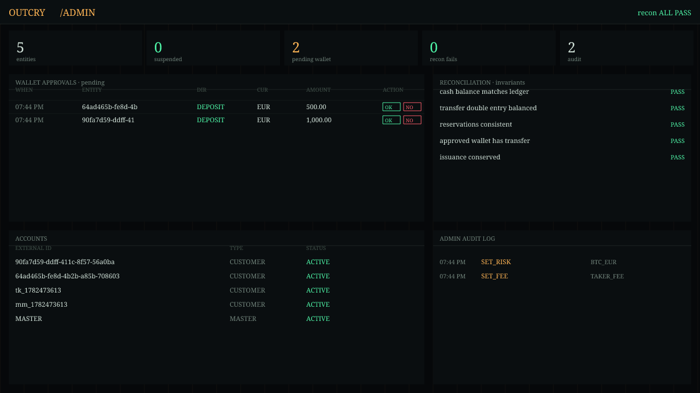
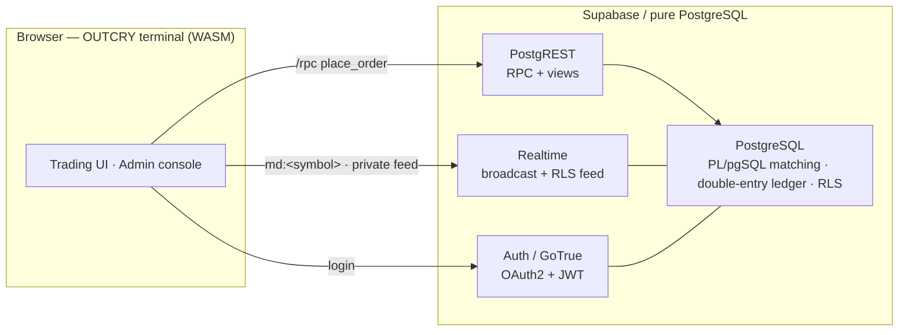
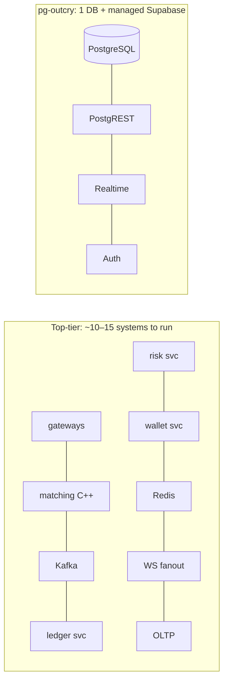

<div align="center">

**English** · [中文](./README.zh-CN.md)

# pg-outcry · OUTCRY

**A complete central exchange (CEX), running entirely inside PostgreSQL.**

Matching · Settlement · Wallet · Risk · Realtime · Auth — **no application server in the request path.**

`PostgreSQL` · `PostgREST` · `Supabase Realtime` · `Supabase Auth (GoTrue)` · `WebAssembly`

[](https://github.com/stars-labs/pg-outcry/actions/workflows/ci.yml) [](./LICENSE)

> ⚠️ **Reference / educational software — not independently audited.** Don't custody real funds without your own audit & compliance review. See [SECURITY.md](./SECURITY.md).

**[▶ Live demo — trading terminal](https://stars-labs.github.io/pg-outcry/?api=https://axtziasfallmdgssbgsl.supabase.co&anon=sb_publishable_j1Jr-NMeKb_P29JcBRhz6Q_0ZkbVzUc)** — real hosted backend. Sign up (instant), open **Wallet → Deposit**, send testnet assets to your assigned address, and trade against a live order book. The **Account** panel exercises API keys, referral, withdrawal whitelist, staking, spot margin, and perpetual futures.

**[▶ Live demo — back-office](https://stars-labs.github.io/pg-outcry/admin.html?api=https://axtziasfallmdgssbgsl.supabase.co&anon=sb_publishable_j1Jr-NMeKb_P29JcBRhz6Q_0ZkbVzUc)** — test-open admin console: sign in or create a Supabase Auth user to try approvals, accounts, fees/risk, referral payouts, derivatives & staking, and audit on the same live data.

**[★ Why pg-outcry — comparison vs top-tier exchanges & the SMB advantage (diagrams)](./docs/WHY.md)**

[Demo → production](#from-demo-to-production) · [Quickstart](#quickstart) · [All docs](./docs/) · [Comparison](./docs/COMPARISON.md) · [Deploy](./docs/DEPLOY.md) · [Benchmark](./docs/BENCH.md) · [Tuning ladder](./docs/TUNING.md) · [Performance](./docs/PERFORMANCE.md) · [Dev](./docs/DEVELOPMENT.md)


<sub>↑ the OUTCRY terminal — order book + candlesticks (SMA/EMA/Bollinger/VWAP) + volume + RSI, rendered from the real WASM engine & live data.</sub>

<details><summary><b>Back-office console</b> (approvals · reconciliation · accounts · audit)</summary>



</details>

</div>

---

## What is this?

The matching engine is ~2,400 lines of **PL/pgSQL** (built on [tolyo/open-outcry](https://github.com/tolyo/open-outcry)).
Everything a trader or operator touches is a **PostgREST RPC**, a **Supabase Realtime** channel, or a **Supabase Auth** session.
There is no Go/Java/Rust order-matching service, no Kafka, no Redis, no separate ledger microservice — the database *is* the exchange.



## Why this design wins

| | Conventional CEX stack | **pg-outcry** |
|---|---|---|
| Matching engine | bespoke C++/Java service | PL/pgSQL inside the DB |
| Settlement | separate ledger service, eventual consistency | **same ACID transaction** as the match |
| Market data | Kafka → fan-out service → WS gateway | Supabase Realtime (broadcast + RLS feed) |
| Per-user security | hand-rolled authz layer | **Postgres RLS** (zero custom authz code) |
| Moving parts | 5–15 services + brokers + caches | **one database + Supabase** |
| Ops team to run it | a platoon | **one or two engineers** |



- **Correct by construction.** Order match *and* full double-entry settlement happen in **one database transaction** — no cross-service synchronization, no "trade booked but ledger lagged" class of bugs.
- **Auditable money.** The ledger is **append-only** (triggers reject UPDATE/DELETE) and a built-in `reconcile()` continuously checks 5 invariants (cash == ledger, double-entry balanced, reservations sane, every approved wallet op has a settlement transfer, issuance conserved). Every admin action is written to an audit log.
- **Realtime included.** Public market data streams over Broadcast (`md:<symbol>`: coalesced L2 + trade tape); each user's order/fill/wallet stream rides Postgres Changes **scoped by RLS** — a user receives only their own rows, with no relay server and no per-user topic wiring.
- **Secure by default.** Identity is Supabase Auth (OAuth2 + email); data isolation is Postgres RLS. Engine internals are locked down (`deny-by-default`, only a whitelist of RPCs is callable).
- **Deploys two ways from one codebase.** Push to **hosted Supabase** for a demo, or **self-host** for a high-performance build (UNLOGGED hot book, native C hot-path, WAL tuning). Privileged migration steps self-skip on hosted.
- **Batteries included.** A polished **WASM trading terminal** (candles + volume + SMA/EMA/Bollinger/VWAP/VMA + RSI/MACD/KDJ/ATR + drawing tools, all computed in WebAssembly) **and** a **back-office console** (approvals, suspensions, fees, risk, reconciliation, audit) ship in this repo.

## Why it's a perfect fit for small & mid-size exchanges

Big exchanges can afford a bespoke C++ matching engine and a 50-person platform team. **Small and mid-size exchanges cannot — and that's exactly who this is for.**

1. **Tiny operational footprint = tiny cost.** One PostgreSQL plus Supabase's managed services. No brokers, no caches, no service mesh. It can run on a modest managed Supabase project or a single VM. A 1–2 person team can operate the whole exchange.
2. **Launch in days, not quarters.** `supabase db reset` applies the schema; open the included terminal and admin console. You start with a *working* exchange, not a pile of microservices to integrate.
3. **Exchange-grade correctness you didn't have to build.** Double-entry ledger, fund reservations/freezes, idempotent deposits/withdrawals, reconciliation invariants, append-only audit trail, per-user RLS — the financial-integrity work that sinks small teams is already done and tested.
4. **Compliance & trust scaffolding out of the box.** Append-only ledger + reconciliation + admin audit log + account suspension + per-instrument risk limits (price bands, max order size/notional) give you the controls auditors and partners ask about.
5. **Cost scales with you.** Start on hosted Supabase; when volume grows, self-host and turn on the performance profile, or shard by symbol across nodes (documented, zero schema change — a CEX has no cross-symbol transactions).
6. **No lock-in, fully inspectable.** The matching and settlement logic is plain SQL you can read, fork, and audit. No black-box engine binary.

> In short: **the correctness, realtime, and compliance of a serious exchange — at the operational complexity and cost a small team can actually carry.**

> 📊 **Deep dive with diagrams:** see **[WHY.md](./docs/WHY.md)** for the side-by-side architecture, order-lifecycle and consistency comparisons against a top-tier-exchange stack, the moving-parts/cost analysis, and the full scaling path.

## Feature set

- **Engine:** limit / market / stop-loss / stop-limit orders; GTC / IOC / FOK; self-trade prevention; maker/taker fees; price-time priority.
- **Settlement:** double-entry ledger, fund reservation/freeze, multi-currency + FX instruments, banker's rounding.
- **Wallet:** deposit/withdrawal requests with admin approval, idempotency keys, reservation on withdrawal.
- **Risk:** per-instrument max order amount / notional / price-band (fat-finger) checks.
- **Realtime:** public L2 + trade broadcast; private RLS-scoped order/fill/wallet feed.
- **Auth & security:** OAuth2 (GitHub/Google) + email; **2FA delegated to the OAuth2 provider** (no separate TOTP); full RLS; deny-by-default function surface.
- **API keys & growth (pure SQL):** per-user **API keys** (HMAC → in-DB-minted JWT, for bots/market-makers), a **referral/affiliate** program (codes, attribution, commission as ledger entries), and **withdrawal whitelist + rolling limits** (address cooling period). See [COMPARISON.md](./docs/COMPARISON.md).
- **Back-office:** approvals queue, suspend/unsuspend, fee & risk config, reconciliation dashboard, audit log.
- **Frontend:** "phosphor terminal" WASM trading UI + admin console.
- **Performance:** per-symbol advisory-lock concurrency, monthly partitioning of trade/ledger, UNLOGGED in-memory book, WAL reduction, coalesced async market data, optional native C extension, **group-commit batch order submission** (`submit_orders` — N orders in one transaction; tune the size with [`scripts/bench-batch.sh`](./scripts/bench-batch.sh), see [TUNING.md](./docs/TUNING.md)).

## Verified

The repo ships smoke tests covering **11 end-to-end flows** — matching, settlement & reservations, realtime tape + L2 broadcast, Auth+RLS isolation, wallet (idempotency + reconciliation), order types, stop-order activation, and the private feed — all green against a clean `supabase db reset`. See [`scripts/`](./scripts) and [`DEVELOPMENT.md`](./docs/DEVELOPMENT.md).

## Benchmark

On a single, **untuned** PostgreSQL (16 vCPU dev box, `synchronous_commit=on`): **~200–270 fully-settled
double-entry trades/sec** per symbol at **~3.5 ms p50** engine latency, scaling to **~560–730/sec**
across 6 symbols in parallel (per-symbol advisory-lock isolation). Each "match" is a *durable, ACID,
double-entry settled* trade — not an in-memory book op. The self-host perf profile
(`synchronous_commit=off`, native C `banker_round`, UNLOGGED book) and symbol sharding raise the
ceiling well beyond. Reproduce: `SERVICE=<key> ./scripts/bench.sh`. Full methodology → [BENCH.md](./docs/BENCH.md);
step-by-step tuning ladder to the ceiling → [TUNING.md](./docs/TUNING.md).

## From demo to production

The same codebase carries you from a click-to-try demo all the way to a tuned production exchange —
each step has a doc:


1. **Try it** — open the [live demo](https://stars-labs.github.io/pg-outcry/?api=https://axtziasfallmdgssbgsl.supabase.co&anon=sb_publishable_j1Jr-NMeKb_P29JcBRhz6Q_0ZkbVzUc) (trading) and the [back-office](https://stars-labs.github.io/pg-outcry/admin.html?api=https://axtziasfallmdgssbgsl.supabase.co&anon=sb_publishable_j1Jr-NMeKb_P29JcBRhz6Q_0ZkbVzUc). Nothing to install; trading funds come through testnet deposits.
2. **Run it locally** — [Quickstart](#quickstart) below: `supabase start` + `supabase db reset` gives you the whole exchange (hosted-Supabase profile in [DEPLOY.md](./docs/DEPLOY.md#demo-deploy-to-hosted-supabase)).
3. **Self-host the high-performance profile** — native C hot-path, WAL tunables, and the market-data ticker: `./scripts/perf-tune-local.sh` → [DEPLOY.md › Local high-performance](./docs/DEPLOY.md#local-high-performance-self-host). What's identical across hosted vs self-host is spelled out in [DEPLOY.md](./docs/DEPLOY.md#whats-identical-across-both).
4. **Tune to the ceiling** — walk the [tuning ladder](./docs/TUNING.md) and pick the [batch size](./docs/TUNING.md#batch-order-submission-group-commit--tuning-the-batch-size) at your throughput/latency knee, measuring on your hardware with [`scripts/bench-ladder.sh`](./scripts/bench-ladder.sh) and [`scripts/bench-batch.sh`](./scripts/bench-batch.sh).
5. **Go live** — production = self-hosted Supabase (or managed PostgreSQL + PostgREST/Realtime/GoTrue) on your own infra, **or** a paid hosted Supabase project. Apply `synchronous_commit=off` + replication/PITR for durable throughput, [shard by symbol](./docs/PERFORMANCE.md#1-shard-by-symbol) to scale out, and complete the operator [hardening checklist](./SECURITY.md#hardening-checklist-for-operators) before custodying real funds.

## Quickstart

```bash
# 0) prerequisites: Docker + Supabase CLI + Node
supabase start          # Postgres + PostgREST + Realtime + Auth (local)
supabase db reset       # apply all migrations

export ANON="$(supabase status -o json | jq -r .ANON_KEY)"
export PUBLISHABLE="$(supabase status -o json | jq -r .PUBLISHABLE_KEY)"
export SERVICE="$(supabase status -o json | jq -r .SERVICE_ROLE_KEY)"

# seed a lively market + candle history (demo)
./scripts/seed-demo.sh
./scripts/seed-candles.sh

# build the WASM engine + serve the terminal
cd web && npm install && npm run build:wasm && python3 -m http.server 4173
#  trader terminal → http://127.0.0.1:4173
#  back-office      → http://127.0.0.1:4173/admin.html
#  test build: sign in or create any Supabase Auth user; every signed-in user is admin

# optional: native C hot-path + DB tunables (self-host)
./scripts/perf-tune-local.sh
```

Run the verification suite (from repo root, with `ANON`/`SERVICE` exported): the `scripts/smoke-*.sh` and `scripts/smoke-*.mjs` flows.

## Project layout

| Path | What |
|---|---|
| `web/` | **OUTCRY** terminal (WASM indicators + drawing tools) and **admin** console |
| `engine/` | Vendored open-outcry PL/pgSQL (matching core), ordered by `manifest.txt` |
| `supabase/migrations/` | Generated engine schema + the `9xxx` platform layers (API, RLS, wallet, risk, realtime, partitioning, lockdown) |
| `ext/oc_fastmath/` | Custom **C extension** (native banker's rounding) + build script |
| `scripts/` | Smoke tests, seeds, benchmark, perf tuning |
| [`docs/`](./docs/) | All deep-dive docs (bilingual): Why · Deploy · Benchmark · Tuning · Performance · Development |

## Roles & security model

- **anon** — public market data only (order book, tape, instruments). No RPCs.
- **authenticated** (user JWT) — self-scoped API: `place_order`, `cancel_order`, `request_deposit`, `request_withdrawal`. RLS limits all reads to the caller's own entity.
- **authenticated operator** (user JWT) — current test build grants every signed-in user full back-office permissions by default. `admin_operator_role` / `admin_role_permission` remain in the schema for later tightening; roles such as `treasury`, `risk`, `support`, `finance`, `security`, `auditor`, and `super_admin` map to granular permissions (`wallet.approve`, `market.write`, `audit.read`, etc.).
- **service_role** (server-side root only) — full engine/admin capability for CI, trusted backend jobs, bootstrap, and the **batch** path `submit_orders(account, instrument, jsonb[])`. Never ship it to browsers.
- `9900_lockdown.sql` revokes EXECUTE on every engine function from public/anon/authenticated and re-grants only the whitelist, so internal helpers (`create_trade`, `update_price_level`, …) are unreachable by clients.

## Realtime feeds

- **Public market data** (no auth): subscribe to **Broadcast** on channel `md:<symbol>` — events `l2` (coalesced order book) and `trade` (tape).
- **Private per-user feed** (auth): call `supabase.realtime.setAuth(jwt)`, then subscribe to `trade_order` (order lifecycle + fills) and `wallet_request` (deposit/withdrawal status). Realtime evaluates each table's RLS per subscriber, so a client receives **only its own rows** — no topic/userId wiring, no server relay. See `examples/private-feed.mjs`.

## License

**AGPL-3.0.** The matching/settlement core under `engine/` derives from
[tolyo/open-outcry](https://github.com/tolyo/open-outcry) (AGPL-3.0); as a derivative
work the entire project is distributed under [AGPL-3.0](./LICENSE) (see [`NOTICE`](./NOTICE)).
If you run a modified version as a network service, AGPL-3.0 requires you to offer users
its source.

## Credits

Matching core based on [**tolyo/open-outcry**](https://github.com/tolyo/open-outcry) (multi-asset matching engine in Go + PL/pgSQL). This project keeps the PL/pgSQL engine, drops the Go layer, and rebuilds the exchange on PostgREST + Supabase Realtime + Supabase Auth, adding the wallet, risk, realtime, back-office, performance work, and the WASM terminal.
