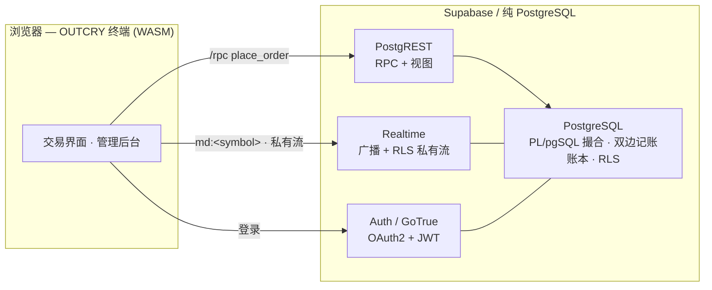
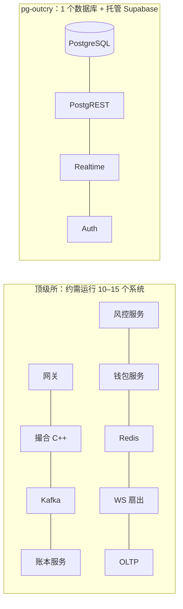

<div align="center">

[English](./README.md) · **中文**

# pg-outcry · OUTCRY

**一套完整的中心化交易所（CEX），全部跑在 PostgreSQL 里。**

撮合 · 结算 · 钱包 · 风控 · 实时行情 · 鉴权 —— **请求路径上没有任何应用服务器。**

`PostgreSQL` · `PostgREST` · `Supabase Realtime` · `Supabase Auth (GoTrue)` · `WebAssembly`

[](https://github.com/stars-labs/pg-outcry/actions/workflows/ci.yml) [](./LICENSE)

> ⚠️ **参考与教育用途，未经独立审计。** 未经自审与合规审查请勿托管真实资金。见 [SECURITY.md](./SECURITY.zh-CN.md)。

**[▶ 在线演示 · 交易终端](https://stars-labs.github.io/pg-outcry/?api=https://axtziasfallmdgssbgsl.supabase.co&anon=sb_publishable_j1Jr-NMeKb_P29JcBRhz6Q_0ZkbVzUc)** —— 真实托管后端。点开即用：注册（秒过）→ 打开「Wallet → Deposit」→ 向分配地址发送测试网资产 → 对着真实盘口下单。**Account** 面板覆盖 API 密钥、推荐返佣、提现白名单、质押、现货保证金、永续合约。

**[▶ 在线演示 · 管理后台](https://stars-labs.github.io/pg-outcry/admin.html?api=https://axtziasfallmdgssbgsl.supabase.co&anon=sb_publishable_j1Jr-NMeKb_P29JcBRhz6Q_0ZkbVzUc)** —— 测试开放管理台：登录或创建 Supabase Auth 用户即可试用审批、账户、费率/风控、推荐返佣结算、衍生品与质押、审计日志，基于同一份真实数据。

**[★ 为什么选 pg-outcry —— 与顶级交易所对比 · 中小所优势（配图）](./docs/WHY.zh-CN.md)**

[从演示到生产](#从演示到生产) · [快速开始](#快速开始) · [全部文档](./docs/) · [横向对比](./docs/COMPARISON.zh-CN.md) · [部署](./docs/DEPLOY.zh-CN.md) · [基准测试](./docs/BENCH.zh-CN.md) · [调优阶梯](./docs/TUNING.zh-CN.md) · [性能](./docs/PERFORMANCE.zh-CN.md) · [开发](./docs/DEVELOPMENT.zh-CN.md)


<sub>↑ OUTCRY 终端 —— 盘口 + 蜡烛（SMA/EMA/布林/VWAP）+ 成交量 + RSI，全部由真实 WASM 引擎 + 实时数据渲染。</sub>

<details><summary><b>管理后台</b>（审批 · 对账 · 账户 · 审计）</summary>


</details>

</div>

---

## 这是什么？

撮合引擎是约 2,400 行 **PL/pgSQL**（基于 [tolyo/open-outcry](https://github.com/tolyo/open-outcry)）。
交易者和运营碰到的一切，都是一次 **PostgREST RPC**、一个 **Supabase Realtime** 频道、或一个 **Supabase Auth** 会话。
没有独立的撮合服务，没有 Kafka、没有 Redis、没有单独的账本微服务 —— **数据库本身就是交易所**。



## 为什么这套架构更优

| | 传统 CEX 技术栈 | **pg-outcry** |
|---|---|---|
| 撮合引擎 | 定制 C++/Java 服务 | 数据库内的 PL/pgSQL |
| 结算 | 独立账本服务，最终一致 | 与撮合**同一个 ACID 事务** |
| 行情 | Kafka → 扇出服务 → WS 网关 | Supabase Realtime（广播 + RLS 私有流） |
| 用户级安全 | 自研鉴权层 | **Postgres RLS**（零自研鉴权代码） |
| 组件数量 | 5–15 个服务 + 消息队列 + 缓存 | **一个数据库 + Supabase** |
| 运维所需团队 | 一个排 | **一两个工程师** |



- **天然正确。** 撮合**和**完整的双边记账结算在**同一个数据库事务**里完成 —— 没有跨服务同步，杜绝「成交了但账本没跟上」这类 bug。
- **资金可审计。** 账本**只追加**（触发器拒绝 UPDATE/DELETE），内置 `reconcile()` 持续校验 5 条不变量（现金==账本、借贷平衡、冻结合理、每笔已批准充提都有结算流水、发行守恒）。每个管理操作都写入审计日志。
- **实时内建。** 公共行情走广播（`md:<symbol>`：合并后的 L2 + 逐笔成交）；每个用户的订单/成交/钱包流走 Postgres Changes 并**由 RLS 限定** —— 用户只收到属于自己的数据，无需中继服务、无需按用户布线频道。
- **默认安全。** 身份用 Supabase Auth（OAuth2 + 邮箱）；数据隔离用 Postgres RLS。引擎内部函数**默认拒绝**，仅放行白名单 RPC。
- **一套代码两种部署。** 推到**托管 Supabase** 做演示，或**自建**跑高性能版（UNLOGGED 内存盘口、原生 C 热路径、WAL 调优）。需要超级权限的迁移步骤在托管上会自动跳过。
- **开箱即用。** 仓库内含一套精致的 **WASM 行情终端**（蜡烛 + 成交量 + SMA/EMA/布林/VWAP/量MA + RSI/MACD/KDJ/ATR + 画线工具，全部 WebAssembly 计算）**和**一套**管理后台**（审批、冻结、费率、风控、对账、审计）。

## 为什么特别适合中小交易所

大所养得起定制 C++ 撮合引擎和五十人的平台团队，**中小交易所养不起 —— 而这套东西正是为你们准备的。**

1. **极小的运维面 = 极低的成本。** 一个 PostgreSQL 加上 Supabase 托管服务。没有消息队列、没有缓存、没有服务网格。一个普通的托管 Supabase 项目或一台 VM 即可运行，**一两个人**就能运营整个交易所。
2. **按天上线，而不是按季度。** `supabase db reset` 装上全部 schema，打开内置的交易终端与管理后台 —— 你拿到的是一个**能跑的交易所**，而不是一堆等你拼装的微服务。
3. **交易所级的正确性，你不用从零造。** 双边记账、资金冻结、幂等充提、对账不变量、只追加审计、用户级 RLS —— 这些能拖垮小团队的金融正确性工作，已经做好并测试过。
4. **合规与信任的脚手架开箱即有。** 只追加账本 + 对账 + 管理审计日志 + 账户冻结 + 按品种风控（价带、单笔/名义上限），正好是审计方和合作方会问到的那些控制项。
5. **成本随你成长。** 先上托管 Supabase；量起来后自建并开启性能档，或按 symbol 跨节点分片（已写明方案、零 schema 改动 —— CEX 不存在跨 symbol 事务）。
6. **无锁定、完全可审。** 撮合与结算逻辑就是你能读、能 fork、能审计的纯 SQL，没有黑盒引擎二进制。

> 一句话：**用小团队真正扛得住的运维复杂度和成本，拿到一家正经交易所的正确性、实时性与合规能力。**

> 📊 **配图深度对比：** 与顶级交易所技术栈的并排架构、订单生命周期与一致性对比、组件数/成本分析，以及完整扩展路径，见 **[WHY.zh-CN.md](./docs/WHY.zh-CN.md)**。

## 功能清单

- **引擎：** 限价/市价/止损/止损限价单；GTC/IOC/FOK；自成交防护；maker/taker 费率；价格-时间优先。
- **结算：** 双边记账账本、资金冻结、多币种 + FX 品种、银行家舍入。
- **钱包：** 充提申请 + 管理员审批、幂等键、提现即冻结。
- **风控：** 按品种的单笔/名义/价带（防胖手指）校验。
- **实时：** 公共 L2 + 成交广播；私有 RLS 限定的订单/成交/钱包流。
- **鉴权与安全：** OAuth2（GitHub/Google）+ 邮箱；**2FA 委托给 OAuth2 提供方**（无需自建 TOTP）；全表 RLS；函数面默认拒绝。
- **API key 与增长（纯 SQL）：** 用户 **API key**（HMAC → 库内签发 JWT，面向机器人/做市商）、**推荐返佣**程序（推荐码、归因、按账本分录计提佣金）、**提现白名单 + 滚动限额**（地址冷却期）。见 [COMPARISON.zh-CN.md](./docs/COMPARISON.zh-CN.md)。
- **后台：** 审批队列、冻结/解冻、费率与风控配置、对账看板、审计日志。
- **前端：** 「磷光终端」风格的 WASM 交易界面 + 管理后台。
- **性能：** 按 symbol 的 advisory-lock 并发、trade/账本月度分区、UNLOGGED 内存盘口、WAL 缩减、合并式异步行情、可选原生 C 扩展、**组提交批量下单**（`submit_orders` —— N 笔订单一个事务；用 [`scripts/bench-batch.sh`](./scripts/bench-batch.sh) 调参，见 [TUNING.md](./docs/TUNING.zh-CN.md)）。

## 已验证

仓库自带覆盖 **11 条端到端流程**的冒烟测试 —— 撮合、结算与冻结、实时成交带 + L2 广播、Auth+RLS 隔离、钱包（幂等 + 对账）、订单类型、止损触发、私有流 —— 在干净的 `supabase db reset` 后全部通过。见 [`scripts/`](./scripts) 与 [`DEVELOPMENT.md`](./docs/DEVELOPMENT.zh-CN.md)。

## 基准测试

在一台**未调优**的单 PostgreSQL（16 vCPU 开发机，`synchronous_commit=on`）上：每个品种 **每秒约 200–270 笔
完全结算的双边记账成交**，引擎延迟 **p50 ≈ 3.5 ms**，6 个品种并行可扩展到 **每秒约 560–730 笔**（按品种
advisory-lock 隔离）。这里的每一次「撮合」都是*持久、ACID、双边记账已结算*的成交 —— 不是内存盘口操作。自建
性能档（`synchronous_commit=off`、原生 C `banker_round`、UNLOGGED 盘口）与 symbol 分片可把上限抬得更高。
复现：`SERVICE=<key> ./scripts/bench.sh`。完整方法学见 [BENCH.md](./docs/BENCH.zh-CN.md)；
逐级调优、冲击上限的阶梯见 [TUNING.md](./docs/TUNING.zh-CN.md)。

## 从演示到生产

同一套代码，带你从「点开即试」的演示一路走到调优后的生产交易所 —— 每一步都有对应文档：

```mermaid
flowchart LR
  A["1 · 试用托管演示<br/>（零安装）"] --> B["2 · 本地运行<br/>supabase start + db reset"]
  B --> C["3 · 自建高性能<br/>原生 C · WAL 调优 · 行情推送"]
  C --> D["4 · 调到上限<br/>基准阶梯 + 批量大小"]
  D --> E["5 · 正式上线<br/>加固 + 扩展（按 symbol 分片）"]
  style A fill:#10231a,stroke:#2a8f63
  style C fill:#10231a,stroke:#4ef7a8
  style E fill:#1a1626,stroke:#9b8cff
```



1. **试用** —— 打开[在线演示](https://stars-labs.github.io/pg-outcry/?api=https://axtziasfallmdgssbgsl.supabase.co&anon=sb_publishable_j1Jr-NMeKb_P29JcBRhz6Q_0ZkbVzUc)（交易）与[管理后台](https://stars-labs.github.io/pg-outcry/admin.html?api=https://axtziasfallmdgssbgsl.supabase.co&anon=sb_publishable_j1Jr-NMeKb_P29JcBRhz6Q_0ZkbVzUc)，无需安装；交易资金通过测试网充值进入。
2. **本地运行** —— 见下方[快速开始](#快速开始)：`supabase start` + `supabase db reset` 即得到完整交易所（托管 Supabase 档见 [DEPLOY.md](./docs/DEPLOY.zh-CN.md)）。
3. **自建高性能档** —— 原生 C 热路径、WAL 调优、行情推送：`./scripts/perf-tune-local.sh` → [DEPLOY.md › 自建](./docs/DEPLOY.zh-CN.md)。托管与自建之间「完全一致」的部分也在 [DEPLOY.md](./docs/DEPLOY.zh-CN.md) 里写明。
4. **调到上限** —— 走一遍[调优阶梯](./docs/TUNING.zh-CN.md)，在你硬件上用 [`scripts/bench-ladder.sh`](./scripts/bench-ladder.sh) 与 [`scripts/bench-batch.sh`](./scripts/bench-batch.sh) 找到[批量大小](./docs/TUNING.zh-CN.md)的吞吐/延迟拐点。
5. **正式上线** —— 生产环境 = 自建 Supabase（或自管 PostgreSQL + PostgREST/Realtime/GoTrue）跑在你自己的基础设施上，**或**付费的托管 Supabase 项目。开启 `synchronous_commit=off` + 复制/PITR 以兼顾持久与吞吐，按 [symbol 分片](./docs/PERFORMANCE.zh-CN.md)横向扩展，并在托管真实资金前完成运营[加固清单](./SECURITY.zh-CN.md)。

## 快速开始

```bash
# 0) 前置：Docker + Supabase CLI + Node
supabase start          # Postgres + PostgREST + Realtime + Auth（本地）
supabase db reset       # 应用全部迁移

export ANON="$(supabase status -o json | jq -r .ANON_KEY)"
export PUBLISHABLE="$(supabase status -o json | jq -r .PUBLISHABLE_KEY)"
export SERVICE="$(supabase status -o json | jq -r .SERVICE_ROLE_KEY)"

# 灌入活跃的行情 + 蜡烛历史（演示）
./scripts/seed-demo.sh
./scripts/seed-candles.sh

# 构建 WASM 引擎 + 启动终端
cd web && npm install && npm run build:wasm && python3 -m http.server 4173
#  交易终端 → http://127.0.0.1:4173
#  管理后台 → http://127.0.0.1:4173/admin.html
#  测试版：任意 Supabase Auth 用户登录/创建后，默认都是管理员

# 可选：原生 C 热路径 + 数据库调优（自建）
./scripts/perf-tune-local.sh
```

在仓库根目录、导出 `ANON`/`SERVICE` 后运行验证套件：`scripts/smoke-*.sh` 与 `scripts/smoke-*.mjs`。

## 项目结构

| 路径 | 内容 |
|---|---|
| `web/` | **OUTCRY** 终端（WASM 指标 + 画线工具）与 **admin** 后台 |
| `engine/` | 内置的 open-outcry PL/pgSQL（撮合内核），按 `manifest.txt` 顺序 |
| `supabase/migrations/` | 生成的引擎 schema + `9xxx` 平台层（API、RLS、钱包、风控、实时、分区、锁定） |
| `ext/oc_fastmath/` | 自定义 **C 扩展**（原生银行家舍入）+ 构建脚本 |
| `scripts/` | 冒烟测试、灌数据、基准、性能调优 |
| [`docs/`](./docs/) | 全部深入文档（双语）：为什么 · 部署 · 基准 · 调优 · 性能 · 开发 |

## 角色与安全模型

- **anon** —— 仅公共行情（盘口、成交带、品种列表），无 RPC。
- **authenticated**（用户 JWT）—— 自限定 API：`place_order`、`cancel_order`、`request_deposit`、`request_withdrawal`。RLS 把所有读取限定在调用者自己的实体上。
- **authenticated operator**（用户 JWT）—— 当前测试版默认给每个已登录用户完整后台权限。`admin_operator_role` / `admin_role_permission` 仍保留在 schema 中，后续收紧时可继续用；`treasury`、`risk`、`support`、`finance`、`security`、`auditor`、`super_admin` 等角色映射到细粒度权限（如 `wallet.approve`、`market.write`、`audit.read`）。
- **service_role**（仅服务端 root）—— 用于 CI、可信后端任务、首次授权以及批量路径 `submit_orders(account, instrument, jsonb[])`。不要下发到浏览器。
- `9900_lockdown.sql` 撤销 public/anon/authenticated 对每个引擎函数的 EXECUTE，只重新放行白名单，因此内部辅助函数（`create_trade`、`update_price_level` 等）客户端无法调用。

## 实时频道

- **公共行情**（免鉴权）：订阅频道 `md:<symbol>` 上的 **Broadcast** —— 事件 `l2`（合并后的盘口）与 `trade`（成交带）。
- **私有用户流**（需鉴权）：调用 `supabase.realtime.setAuth(jwt)`，然后订阅 `trade_order`（订单生命周期 + 成交）和 `wallet_request`（充提状态）。Realtime 对每个订阅者按表的 RLS 求值，客户端**只收到属于自己的数据** —— 无需 topic/userId 布线、无服务端中继。见 `examples/private-feed.mjs`。

## 许可证

**AGPL-3.0。** `engine/` 下的撮合/结算内核衍生自
[tolyo/open-outcry](https://github.com/tolyo/open-outcry)（AGPL-3.0）；作为衍生作品，整个项目以
[AGPL-3.0](./LICENSE) 分发（见 [`NOTICE`](./NOTICE)）。按 AGPL 条款，若你以网络服务形式运行修改版，
须向用户提供其源码。

## 致谢

撮合内核基于 [**tolyo/open-outcry**](https://github.com/tolyo/open-outcry)（Go + PL/pgSQL 的多资产撮合引擎）。本项目保留其 PL/pgSQL 引擎、去掉 Go 层，在 PostgREST + Supabase Realtime + Supabase Auth 之上重建交易所，并补齐了钱包、风控、实时、后台、性能优化与 WASM 终端。
