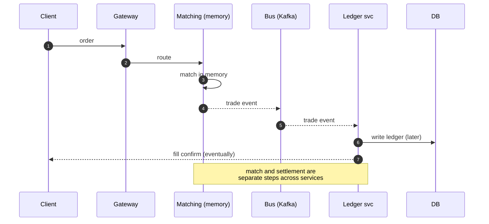
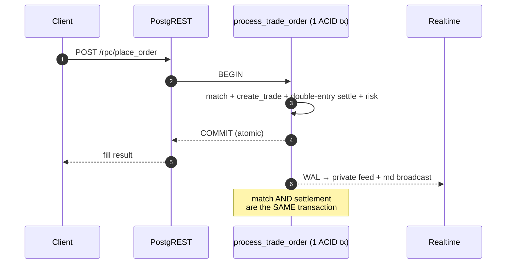
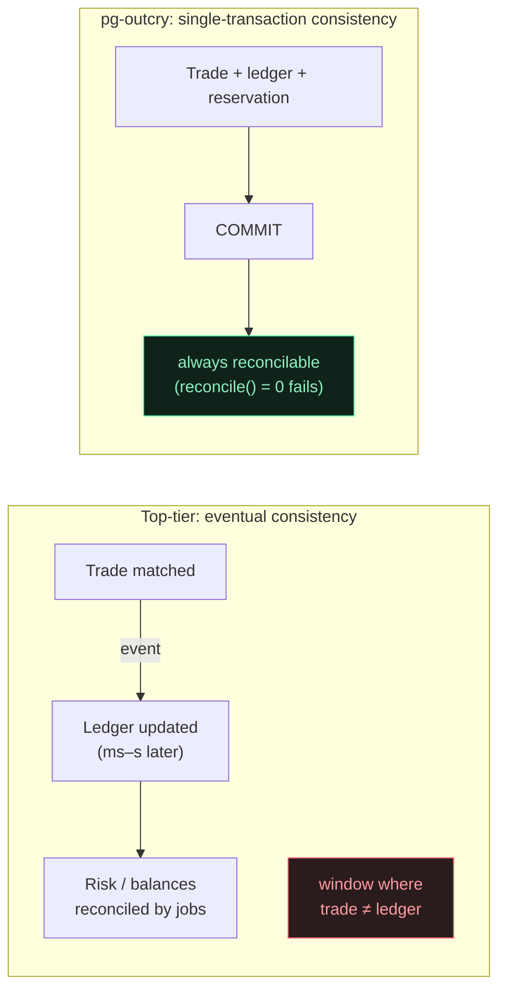
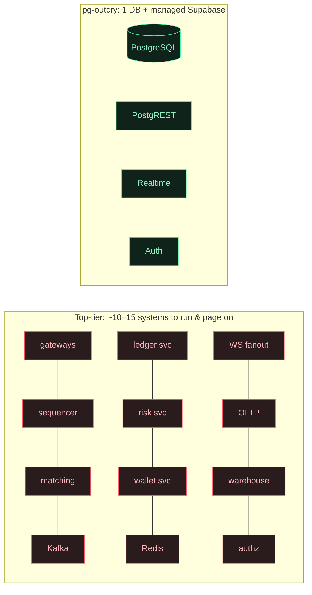
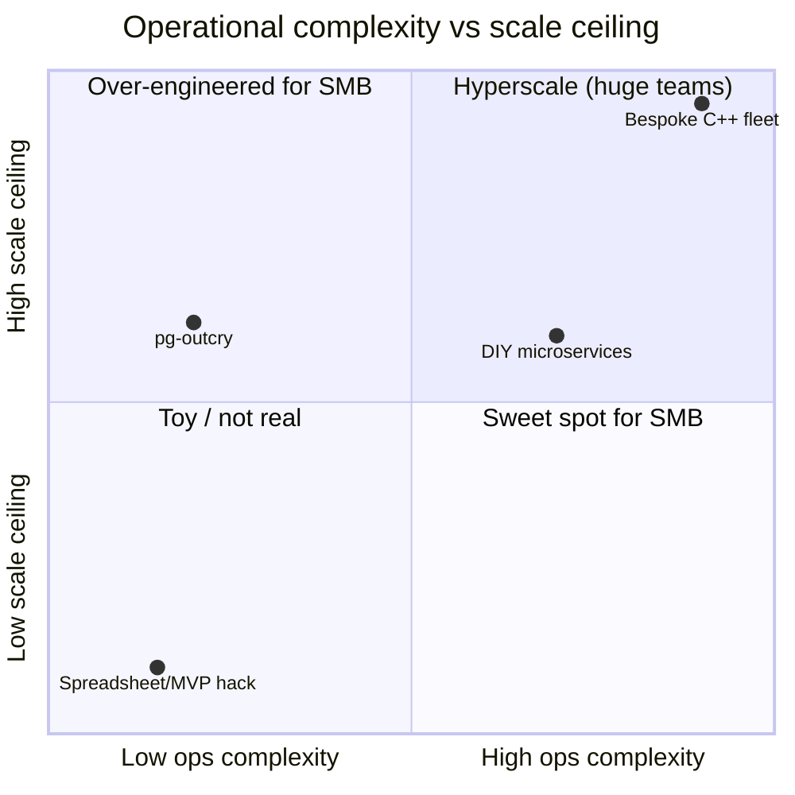

# Why pg-outcry

**Architecture, the top-tier-exchange comparison, and the small/mid-size-exchange advantage.**

[← Back to README](./README.md)

---

## 1. Two architectures, side by side

A top-tier exchange (Binance / Coinbase / Kraken-class) is a **fleet of specialized services** wired together by a message bus, tuned for microsecond latency and millions of orders/sec.

```mermaid
flowchart TB
  subgraph TopTier["Top-tier exchange — a distributed fleet"]
    direction TB
    GW["FIX / REST / WS gateways"] --> SEQ["Sequencer"]
    SEQ --> ME["In-memory matching engine<br/>(C++, per-symbol, Disruptor)"]
    ME --> BUS{{"Message bus<br/>Kafka / Aeron"}}
    BUS --> MD["Market-data publishers"] --> WSF["WS fan-out gateways"]
    BUS --> LED["Settlement / ledger service"]
    BUS --> RSK["Risk engine"]
    BUS --> WAL["Wallet / funding service"]
    LED --> ODB[("OLTP DB")]
    WAL --> ODB
    RSK --> CACHE[("Redis cache")]
    LED --> DWH[("Warehouse")]
    ME -.journaling.-> JRNL[("Journal + snapshots<br/>for crash replay")]
  end
  style ME fill:#1c2b22,stroke:#4ef7a8
  style BUS fill:#2a1c1c,stroke:#ff5d6c
```

pg-outcry collapses that fleet into **one database plus Supabase's managed services**. The matching engine, ledger, and risk are PL/pgSQL functions; durability, ACID, and crash recovery are the database's job.

```mermaid
flowchart TB
  subgraph PG["pg-outcry — one database is the exchange"]
    direction TB
    PR["PostgREST<br/>(RPC + views)"] --> FN
    RT["Realtime<br/>(broadcast + RLS feed)"] --- WALX[("WAL")]
    AU["Auth / GoTrue"] --- DB
    subgraph DB["PostgreSQL"]
      FN["process_trade_order()<br/>match + settle in ONE ACID tx"] --> LEDG["double-entry ledger<br/>(append-only)"]
      FN --> RISK["risk checks"]
      FN --> BOOK["price_level / book_order<br/>(UNLOGGED, in-memory)"]
      LEDG --> WALX
    end
  end
  CL["Browser — WASM terminal + admin"] -->|/rpc| PR
  CL -->|md:&lt;symbol&gt; · private feed| RT
  CL -->|OAuth2| AU
  style FN fill:#1c2b22,stroke:#4ef7a8
```

---

## 2. The order lifecycle

The difference is starkest when you trace one order. The top-tier path crosses many services; **correctness becomes a distributed problem** (the trade is matched in memory, then the ledger catches up via events).

In pg-outcry the entire match **and** double-entry settlement happen inside **one database transaction**. When the RPC returns, the trade and the money have moved together — atomically — or not at all.

---

## 3. Consistency model

> At scale, the eventual-consistency window is a *feature* (throughput). For a small/mid exchange it is mostly a *liability* — it's where the "trade booked but balance wrong" support tickets and audit findings come from. pg-outcry removes the window entirely.

---

## 4. Why not their tech stack?

Each piece of a top-tier stack solves a **scale** problem. At small/mid scale it mostly adds **cost and failure surface**.

| Their component | Why it exists at scale | Why it's a liability for SMB | pg-outcry instead |
|---|---|---|---|
| **In-memory C++ engine** | µs latency, millions ops/s | needs custom journaling, snapshots, replay, failover — months of work | PL/pgSQL match; the DB gives ACID + durability + recovery for free |
| **Kafka / Aeron bus** | decouple services, replay streams | another distributed system to run; **introduces eventual consistency** | one transaction; Realtime reads the WAL |
| **Redis cache** | balances/book live outside the DB | cache-invalidation bugs; another HA system | hot data is `shared_buffers` + UNLOGGED tables in the same DB |
| **Ledger / risk / wallet microservices** | independent scaling | N deploys, N on-call, distributed transactions / sagas | functions in one schema, one transaction |
| **Bespoke authz layer** | per-tenant isolation | a whole service to build & secure | Postgres **RLS** — zero custom authz code |
| **WS fan-out fleet** | millions of subscribers | infra + scaling to operate | Supabase Realtime, RLS-scoped, managed |

**The throughput a top-tier stack buys is real — and irrelevant if you trade thousands (not millions) of orders/sec.** You'd be paying the full operational price of hyperscale to serve a fraction of the load.

---

## 5. Moving parts & failure surface

Fewer parts → fewer failure modes → fewer people on call → lower cost. Every box you don't run is a box that can't page you at 3am.

---

## 6. Cost & team to operate

A bespoke fleet sits top-right (huge scale, huge ops). pg-outcry sits in the **SMB sweet spot**: low operational complexity with a scale ceiling that comfortably covers small and mid-size venues — and a documented path to push the ceiling higher when needed (§8).

---

## 7. The small/mid-size advantage, in depth

### 7.1 Operations & cost
One PostgreSQL + Supabase. No brokers, caches, or service mesh. Runs on a managed Supabase project or a single VM; **one or two engineers** operate the entire exchange. You pay for one system, not a fleet.

### 7.2 Time to market
`supabase db reset` applies the schema; open the included terminal and admin console. You start with a **working exchange**, not an integration project. Days, not quarters.

### 7.3 Correctness you didn't have to build
Double-entry ledger, fund reservation/freeze, idempotent deposits/withdrawals, single-transaction settlement, append-only ledger, per-user RLS — the financial-integrity work that sinks small teams is done and tested.

### 7.4 Compliance & trust scaffolding

```mermaid
flowchart LR
  TX["every trade / transfer"] --> L["append-only<br/>double-entry ledger"]
  L --> R["reconcile()<br/>5 invariants"]
  ADM["admin action"] --> AUD["audit log"]
  L --> RPT["balances always<br/>re-derivable"]
  R --> OK{{"0 fails = books balance"}}
  style OK fill:#10231a,stroke:#4ef7a8
```

Append-only ledger + continuous reconciliation + admin audit log + account suspension + per-instrument risk limits = the controls auditors and banking partners ask about, built in.

### 7.5 Realtime & UX without a team
Public market data (coalesced L2 + tape) over Broadcast; each user's private order/fill/wallet stream over RLS-scoped Postgres Changes — **no relay server, no per-user topic plumbing**. The included WASM terminal already renders candles + full TA + drawing tools client-side.

### 7.6 Inspectable, no lock-in
Matching and settlement are plain SQL you can read, fork, and audit. No black-box engine binary, no proprietary protocol.

---

## 8. "Won't we outgrow it?" — the scaling path

You grow **along one axis at a time**, without rewrites:

```mermaid
flowchart LR
  S1["① Hosted Supabase<br/>demo → production"] --> S2["② Self-host high-perf<br/>UNLOGGED book · WAL tuning<br/>native C hot-path"]
  S2 --> S3["③ Shard by symbol<br/>1 project per symbol set<br/>stateless router"]
  S3 --> S4["④ Read replicas for<br/>market data / analytics"]
  style S1 fill:#10231a,stroke:#2a8f63
  style S2 fill:#10231a,stroke:#4ef7a8
  style S3 fill:#11202b,stroke:#5ad8ff
  style S4 fill:#1a1626,stroke:#9b8cff
```

Per-symbol concurrency is already there (advisory locks): different symbols never block each other. Because **a CEX has no cross-symbol transactions**, sharding by symbol across nodes is clean and needs **zero schema change** — each shard is the identical migration set owning a disjoint symbol set, behind a stateless router, with a shared identity/wallet plane.

---

## 9. When NOT to use this

Honesty builds trust. If you need **sub-100µs matching**, **millions of orders/sec on a single symbol**, or **co-located HFT** market structure, build a bespoke in-memory engine — that's what the top-tier stack is *for*.

pg-outcry targets the **vast majority of venues that aren't that**: regional and retail exchanges, altcoin/spot venues, brokerage matching, prediction & simulation markets, and new exchanges that need to launch correct, compliant, and cheap — then scale deliberately.

**Exchange-grade correctness, realtime, and compliance — at the complexity and cost a small team can actually carry.**

[← Back to README](./README.md)

